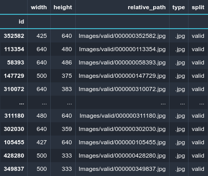
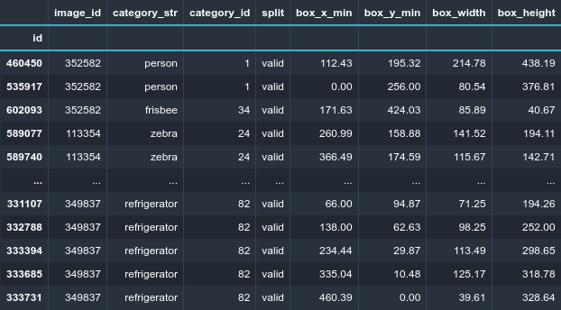

<!-- markdownlint-disable MD041 -->
<!-- markdownlint-disable MD033 -->
<div align="center">
<p align="center">
  
</p>

#### The ultimate companion library for object detection data

| 📚 [Docs](https://lours.readthedocs.io)| 📊 [Slides](https://docs.google.com/presentation/d/1crfwQmDnzkMmekznpZZiX0E0XPEhCAOkFPWa1NmflXU/pub) | 📝 Blogpost (coming soon) |

[](https://codecov.io/gh/XXII-AI/Lours) [](https://github.com/XXII-AI/Lours/blob/main/LICENSE) [](https://pypi.org/project/lours/)
 [](https://pypi.org/project/lours/) [](https://pypi.org/project/lours/) [](https://lours.readthedocs.io/)

</div>

## Why Lours ?

The overall complexity and lack of standardization in public object detection data makes it painstakingly hard to work with. Lours is a library that makes construction, conversion and manipulation of any detection dataset easy, fast and reliable.

<p align="center">
  
</p>


### The `Dataset` class

At its core, Lours features a unified `Dataset` class. It offers :

- Seamless conversion between popular formats (COCO, PascalVOC, FiftyOne, ...)
- Powerful dataset operations (merging, smart train/val splitting, class remapping, bbox format conversion...)
- Image and Object-Level indexing
- ... and much more !

A Lours dataset object is essentially composed of two `pandas.DataFrame` :

- `images` containing image-level data
- `annotations` containing object-instance-level data

```python
from lours.dataset import Dataset, from_coco
COCO_dataset = from_coco("docs/notebooks/notebook_data/coco_valid.json")
COCO_dataset
```

<p align="center">
  
  
</p>

In addition to Lours-specific utilities and functions, most operations supported by pandas DataFrames can also be applied seamlessly to Lours datasets.

Check the [Dataset 101 Tutorial](https://lours.readthedocs.io/stable/notebooks/1_demo_dataset.html#) or the full [API Reference](https://lours.readthedocs.io/latest/dataset.html) for more details about the `Dataset` class.

### Evaluators

Lours also features evaluators to compare a set of predictions to a ground truth in several settings :

- `DetectionEvaluator`
- `CrowdDetectorEvaluator`

Check the [Object Detection Evaluation Tutorial](https://lours.readthedocs.io/stable/notebooks/3_demo_evaluation_detection.html) of the [API Reference](https://lours.readthedocs.io/stable/evaluation.html) for more details.

## Installation

Simply run :

```bash
pip install lours
```

You can also install the pre-release by adding the `--pre` option

```bash
pip install lours --pre
```

### From source

- `pip`

```bash
git clone https://github.com/XXII-AI/Lours.git
cd Lours
pip install -e . # Only for pip > 21.3
```

- `poetry >= 1.2`

Assuming both lours and your project are in the same folder, adapt the relative path of the repo if needed

```bash
poetry add --editable ../lours/
poetry add --editable https://github.com/XXII-AI/lours.git
```

## Tutorials

A list of tutorials is available in the Lours documentation [here](https://lours.readthedocs.io/stable/tutorials.html).

We also provide examples notebooks in the `docs/notebooks` folder.

## Documentation

For details about the Lours API, see the reference documentation :

- [stable](https://lours.readthedocs.io/stable/)
- [latest](https://lours.readthedocs.io/latest/)
